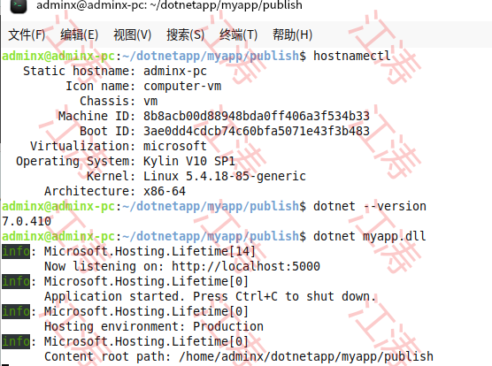

# 背景

- 随着信息技术的迅猛发展，国家对网络安全和信息安全的重视程度不断提高。国产化信息技术产品和服务成为国家战略的重要组成部分，以确保国家信息的安全性和自主可控性。
- 本文将探讨如何使用.NET框架进行国产化信创，介绍相关的技术和实践经验，帮助读者了解.NET框架在国产化信创中的应用和优势，并助力国内企业和组织实现自主可控的信息技术解决方案

# 实践过程

## 环境搭建

分别在阿里云和本地虚机安装麒麟镜像作为测试环境

* arm架构
  
  
* x86-64架构
  
  

## 数据库迁移

将SQL Server迁到国产达梦数据库,表结构及字段类型、存储过程、触发器、函数、视图均支持


## 代码升级

1. 由于没有使用`ORM`框架,目前是通过配置来实现,配置文件`appsettings.json`、节点`DatabaseSettings`
   
   - `ProviderType` 目前支持`SQLServer`、`Dameng` 等多种方式访问数据库,如不配置则默认`SQLServer`方式
   - `ConnectionString` 数据库连接字符串
   - `DmDtVarchar36ToGuid` 由于达梦数据库对`Guid`方式支持不友好,可以通过字段`varchar(36)`来替代
   
   ```json
   {
     "DatabaseSettings": {
       "ProviderType": "Dameng",
       "ConnectionString": "Server=127.0.0.1:5237; UserId=xxx; PWD=xxx;Schema=xxxx",
       "DmDtVarchar36ToGuid": true
     }
   }
   ```
2. 程序通过配置支持多种数据库方式，每种数据库`SQL`语句可能存在差异，目前是通过抽象出来一层`SQL`来实现
   
   示例1：在代码里面通过脚本来创建函数 `SQLServer` 和 `Dameng` 语法不同
   
   - 定义接口 `IXXXXSqlConsts`
     
     ```c#
     public interface IXXXXSqlConsts
         {
             /// <summary>
             /// XXXSql 
             /// </summary>
             string XXXSql { get; }
         }
     ```
   - 针对上面接口分别对指定文件夹（参考现有代码）对 `SQLServer` 和 `Dameng` 实现
     
     ```c#
     /// <summary>
         /// SQLServer
         /// </summary>
         public class SQLServerSqlConsts : IXXXXSqlConsts
         {
             /// <summary>
             /// 
             /// </summary>
             public string XXXSql { get; } = @" select * from a ";
         }
     
         /// <summary>
         ///Dameng
         /// </summary>
         public class DamengSqlConsts : IXXXXSqlConsts
         {
             /// <summary>
             /// 
             /// </summary>
             public string XXXSql { get; } = @" select * from b";
         }
     ```
   - 通过代码获取接口实例,这样就能根据不同的配置获取到不同的`SQL`
     
     ```c#
     IXXXXSqlConstsisqlConsts = LazyGetRequiredService<IXXXXSqlConsts>();
      string sql = isqlConsts.XXXSql ;
     ```


## 测试与部署

