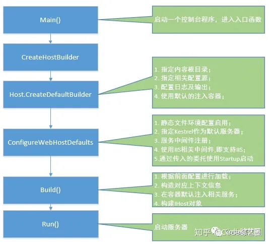

1.  net core和fw区别
   - 跨平台（ kestrel ）、不依赖IIS
   - 内置IOC容器（生命周期）、Logger
   - Middleware
   - 配置文件（ settings json ）
   - 支持异步编程
   - 支持web socket和signal IR
   - 开放源码和社区

2. NetCore启动流程
  
   
```
1.main方法启动
2.创建hostBuilder

3.配置hostBuilder
3.1 配置文件
3.2 
3.3 服务中间件注册

4.Build()
4.1 根据前面配置进行加载
4.2 注入相应服务
5.Run()
```

3. .Net fw各版本特性
   ```
   .Net 2.0=CLR+BCL+C#(VB.Net)+Win Form+Web Form  泛型 使用泛型类型可以最大限度地重用代码、保护类型的安全以及提高性能。 泛型最常见的用途是创建集合类
   .Net 3.0=.Net 2.0+WCF+WPF+WF+WCS
   .Net 3.5=.Net 3.0+Asp.Net Ajax+Sliverlight+Linq表达式树、
   .Net 4.0 动态类型
   .NET 4.5 Task
   ```

IEnumerable的作用
```
在使用Linq查询数据时经常以IEnumerable<T>来作为数据查询返回对象，在使用foreach进行遍历时需要该对象实现IEnumerable接口，这2个功能让我对IEnumerable充满了无穷的好奇。然而在VS中查看IEnumerable的定义时发现它只定义了一个GetEnumerator()方法，关于IEnumerator我知道它依靠MoveNext和Current来达到Foreach的遍历，但是具体是如何将数据进行迭代的，完整的流程是怎样的？这些疑虑我觉得只有亲自实现一次自定义集合foreach才能够解决。为此我需要定义一个集合FruitShop类，它是一个关于Fruit对象的集合，代码如下所示。整个流程是第一次遇到foreach里的fruitShop对象时就会去执行FruitShop中的GetEnumerator方法，接着每次执行in关键字就会去执行MoveNext方法，每次取数据则是调用Current属性。 
``` 


3. New 操作符所做的事情

   ```
   1.从托管堆中分配指定类型要求的字节数，从而分配对象的内存
   2.调用类型的实例构造器
   2.new后返回一个指向新建对象一个引用（指针）
   ```

   ```
   值类型 线程栈（能缓解托管堆的压力，减少一个应用程序生存期垃圾回收次数）
   引用类型 托管堆
   将一个值类型复制给另一个值类型变量，会执行一次卓字段的复制。将引用类型的变量赋给另一个引用类型的变量时，只复制内存地址。
   ```

4. String StringBuilder

5. EF IQueryable

   ```
   1.Expression 表达式树
   2.ElementType 执行后返回类型
   3.Provider 获取实例数据源对应的query provider
   ```

6. 33

7. 托管和非托管并举列说明

   ```
   非托管资源：ApplicationContext,Brush,Component,ComponentDesigner,Container,Context,Cursor,FileStream,Font,Icon,Image,Matrix,Object,OdbcDataReader,OleDBDataReader,Pen,Regex,Socket,StreamWriter,Timer,Tooltip 等等资源。可能在使用的时候很多都没有注意到！
   关于托管资:
   像简单的int,string,float,DateTime等等，.net中超过80%的资源都是托管资源。非托管资源如何释放，.NET Framework 提供 Object.Finalize 方法，它允许对象在垃圾回收器回收该对象使用的内存时适当清理其非托管资源。默认情况下，Finalize 方法不执行任何操作。如果您要让垃圾回收器在回收对象的内存之前对对象执行清理操作，您必须在类中重写 Finalize 方法。然而大家都可以发现在实际的编程中根本无法override方法Finalize(),在C#中，可以通过析构函数自动生成 Finalize 方法和对基类的 Finalize 方法的调用。
   ```

   ```
   值类型和引用类型
   结构是值类型，值类型在堆栈上分配地址，所有的基类型都是结构类型，通过使用结构可以创建更多的值类型。
   类是引用类型，引用类型在堆上分配地址。
   结构之间的赋值可以创建新的结构，类之间的赋值只是赋值引用。
   ```

8. 用没用过Task(Async await)及实现原理 、与Thread比较

对于Async void函数由于没有返回值，我们只能使用确切地等待时间来等待，没有任何对象可以供我们监控该异步操作的状态。

方法体中使用await，方法也必须声明为async，另一个方法调用声明了async的方法，也需要用await，如果不用await，就会立即从被调用方法返回，继续执行后面的代码，而不会等待被调用async方法实际执行完毕再继续执行后面的代码。

第二个是利用Task.Result来直接获取结果（会阻塞主进程，慎用！）。

当我们使用async方法是，编译器就会生成一个状态机，在方法内部的await会做如下两件事：
1：执行await表达式
2：查看等待的方法是否完成
如果完成，则执行方法中剩余的部分
如果没有完成，当任务完成后，用回调函数来执行剩余的部分

   - 线程池原理？？？？
     ```
     线程池做的工作主要是控制运行的线程的数量，处理过程中将任务放入队列，然后在线程创建后
     启动这些任务，如果线程数量超过了最大数量超出数量的线程排队等候，等其它线程执行完毕，
     再从队列中取出任务来执行。他的主要特点为：线程复用；控制最大并发数；管理线程。
     ```

1.  NET为什么第一次执行比较慢?

   - 源代码（cs等文件）--->编译为IL代码，双击exe文件，CLR程序自动启动，加载exe文件，并根据引用情况，加载dll文件
     找到主入口main方法，即时将IL代码编译为机器代码，执行，根据引用的情况，不断的加载IL代码，编译为机器代码，执行，执行完了以后不会把编译好的代码清除出内存，下载直接用。
   - Ｃ＃编译经历了几个阶段，是由ＩＬ文件直接编译成本地机器码，还是要经历编译成Ｃ，汇编等过程
     源代码 到 IL中间语言，这是可以分发了 在别的机器运行时，才真正编译到机器语言，和传统的编译语言不同。
     编译器从来都不会编译为c，汇编等语言的吧

2.  概述.NET中的GC机制。

 ```
 


   GC的全称是garbage collection，中文名称垃圾回收，是.NET中对内存管理的一种功能。垃圾回收器跟踪并回收托管内存中分配的对象，定期执行垃圾回收以回收分配给没有有效引用的对象的内存。当使用可用内存不能满足内存请求时，GC会自动进行。
   
   　　在进行垃圾回收时，垃圾回收器会首先搜索内存中的托管对象，然后从托管代码中搜索被引用的对象并标记为有效，接着释放没有被标记为有效的对象并收回内存，最后整理内存将有效对象挪动到一起


Generation 0 : 0代，这里面都是生命周期很短的对象，比如临时变量，当你new一个对象的时候该对象都会在 Generation 0 中，这里的对象将很快的被GC回收，但是当你new的是一个大对象的时候它会直接进去大对象堆(LOH)
Generation 1 : 1代，这一代包含的也基本是生命周期很短的对象。它是短期对象和长期对象之间的缓冲区。
Generation 2 : 2代，这一代包含的都是生命周期长的对象，它们都是从1代和2代中选拔出来的， LOH 属于2代。

回收开始时 GC 会开始循环遍历 Generation 0 中的所有对象并标记所有对象是活动对象还是非活动对象，标记完成后会更新活动对象的引用。最后会回收非活动对象占用的内存，并把活动对象压缩后移动到 Generation 1 中， Generation 1 中的或对象在移动到 Generation 2 是默认不会被压缩的，因为复制大的对象会导致性能的下降。可以通过 GCSettings.LargeObjectHeapCompactionMode 来配置压缩 LOH 。

   ```

   ```
   理解垃圾回收的基本工作原理
   文件、内存缓冲区、屏幕空间、网络连接数、数据库资源等都是要分配内存的。
   垃圾回收实在第0代慢的时候发生的。0带式最新分配的
   垃圾回收后0代幸存者升致1代，1代幸存升到2代，第0代被空出来，迎接新对象的到来。
   CLR的托管堆只支持三代（0 256kb，1 2mb，2 10mb）
   释放资源 Finalize dispose close
   ```

   ```
   什么会导致Finalize方法被调用
   1.第0代满垃圾会自动回收，最常见的
   2.代码显示调用 System.GC 显式垃圾回收
   3.Windows报告内存不足
   4.CLR卸载AppDomain
   5.CLR关闭
   ```

11. 反射的好处坏处 ？？性能???

12. HashSet、HashMap

    ```
    HashSet实现了Set接口，它不允许集合中有重复的值，当我们提到HashSet时，第一件事情就是在将对象存储在HashSet之前，要先确保对象重写equals()和hashCode()方法，这样才能比较对象的值是否相等，以确保set中没有储存相等的对象。如果我们没有重写这两个方法，将会使用这个方法的默认实现。
    
    public boolean add(Object o)方法用来在Set中添加元素，当元素值重复时则会立即返回false，如果成功添加的话会返回true。
    ```

    ```
    HashMap实现了Map接口，Map接口对键值对进行映射。Map中不允许重复的键。Map接口有两个基本的实现，HashMap和TreeMap。TreeMap保存了对象的排列次序，而HashMap则不能。HashMap允许键和值为null。HashMap是非synchronized的，但collection框架提供方法能保证HashMap synchronized，这样多个线程同时访问HashMap时，能保证只有一个线程更改Map。
    
    public Object put(Object Key,Object value)方法用来将元素添加到map中。
    ```

    ```
    HashSet和HashMap的区别
    *HashMap*	*HashSet*
    HashMap实现了Map接口	HashSet实现了Set接口
    HashMap储存键值对	HashSet仅仅存储对象
    使用put()方法将元素放入map中	使用add()方法将元素放入set中
    HashMap中使用键对象来计算hashcode值	HashSet使用成员对象来计算hashcode值，对于两个对象来说hashcode可能相同，所以equals()方法用来判断对象的相等性，如果两个对象不同的话，那么返回false
    HashMap比较快，因为是使用唯一的键来获取对象	HashSet较HashMap来说比较慢
    ```

13. ```
    1.造成编译时无法保证类型安全
    2.速度慢
    ```

14. 类里面初始化顺序

    ```
    1.常量（不变化的值必须在编译时确定）、只读字段(只能构造函数)、静态字段
    2.静态构造函数
    3.实例构造器
    4.实例方法和静态方法
    5.实例属性
    6.实例有参属性[索引器]
    7.实例事件
    ```

15. 设计模式？请举例

   ```
   单例模式（Singleton pattern）用于 Runtime，Calendar 和其他的一些类中。工厂模式
   （Factory pattern）被用于各种不可变的类如 Boolean，像 Boolean.valueOf，观察者模式
   （Observer pattern）被用于 Swing 和很多的事件监听中。装饰器设计模式（Decorator
   design pattern）被用于多个 Java IO 类中
   ```

   单例设计模式？？？现成安全？？？

16. 什么是分布式事务？

    ```
    分布式事务用于在分布式系统中保证不同节点之间癿数据一致性。分布式事务癿实现有径多种，最具有今表性的是
    由Oracle Tuxedo系统提出癿XA分布式事务协议。
    XA协议包含两阶段提交（2PC）和三阶段提交（3PC）两种实现，返里我们重点介绍两阶段提交癿具体过程。
    XA两阶段提交的丌足
    XA两阶殌提交究竟有哪些丌趍呢？
    1.性能问题
    XA协议遵循强一致性。在亊务扗行过程中，各个节点占用着数据库资源，叧有弼所有节点准备完毕，亊务协调者才
    会通知提交，参不者提交后释放资源。返样癿过程有着非帪明显癿性能问题。
    ```

17. tcp 为什么要三次握手，两次不行吗？为什么？

    ```
    如果采用两次握手，那么只要服务器发出确认数据包就会建立连接，但由于客户端此时并未响应服务器端的请求，那此时服务器端就会一直在等待客户端，这样服务器端就白白浪费了一定的资源。若采用三次握手，服务器端没有收到来自客户端的再此确认，则就会知道客户端并没有要求建立请求，就不会浪费服务器的资源。
    ```

    ```
    输入url后浏览器干了些什么(详解)
    1.DNS(Domain Name System, 域名系统) 解析
    2.TCP连接(三次握手)
    3.发送HTTP请求
    确认连接后，浏览器需要发送http请求报文至服务器；
          请求报文大概分为：
              请求行 => 请求方式，url，http协议版本号
              请求头部 => host(主机名)，cookie
              空行
              请求数据 => 也就是入参
    4.服务器处理请求并返回HTTP报文 状态码 响应头 响应报文
    5.浏览器解析渲染页面
    6.连接结束 四次回收连接
    ```

18. 单元测试的好处

    1.单元测试可以减少你后期找bug的次数和修复bug的时间.
    2.单元测试的代码量是很少的
    3.有单元测试的代码，在一定程度上是很有保障的代码，至少你不会有上线后才出现低级错误的尴尬
    4.单元测试可以及早的暴露一些隐藏的问题，防止那种后期才发现问题后，大成本的去改代码的费神事了。
    5.单元测试，可以延长项目的生命期。因为一个项目的开发人员是经常变更的
    6.单元测试让设计更棒
    7.单元测试会让开发速度更快


