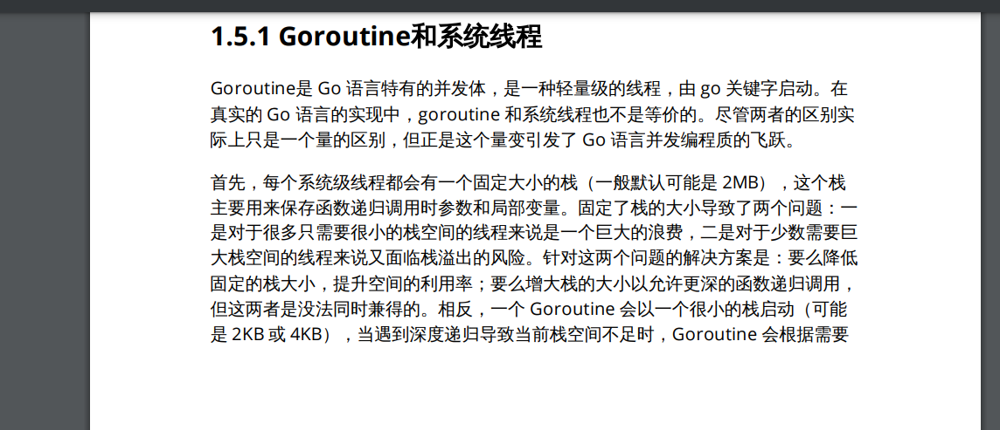
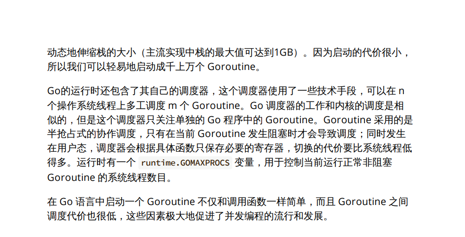

##### = 和 := 有什么区别

```
= 是赋值
:= 是声明并赋值
一个变量只能声明一次，使用多次 := 是不允许的，而当你声明一次后，却可以赋值多次，没有限制。
```

##### nil切片和空切片指向的地址一样吗？这个代码会输出什么？
```
nil切片和空切片指向的地址不一样。
nil空切片引用数组指针地址为0（无指向任何实际地址）
空切片的引用数组指针地址是有的，且固定为一个值
```

##### 字符串转成byte数组，会发生内存拷贝吗？
```
字符串转成切片，会产生拷贝。严格来说，只要是发生类型强转都会发生内存拷贝。那么问题来了。

StringHeader 是字符串在go的底层结构。
那么如果想要在底层转换二者，只需要把 StringHeader 的地址强转成 SliceHeader 就行。那么go有个很强的包叫 unsafe 。
```

##### 什么是指针和指针变量

```
&：地址运算符，从变量中取得值的内存地址
*：解引用运算符，从内存地址中取得存储的数据
意义一：省内存
当你往一个函数传递参数时，若该参数是一个值类型的变量，则在调用函数时，会将原来的变量的值拷贝一遍。

意义二：易编码
写了一个函数来实现更新某对象里的一些数据，在值类型的变量中，若不使用指针，则函数需要重新返回一个更新过的全新对象。
而有了指针，则可以不用返
```

##### 有异常类型吗


##### new 和 make 的区别

```go
值类型是 int、float、string、bool、struct和array，它们直接存储值，分配栈的内存空间，它们被函数调用完之后会释放
引用类型是 slice、map、chan和值类型对应的指针 它们存储是一个地址（或者理解为指针）,指针指向内存中真正存储数据的首地址，内存通常在堆分配，通过GC回收

new 的参数要求传入一个类型，而不是一个值，它会申请该类型的内存大小空间，并初始化为对应的零值，返回该指向类型空间的一个指针
make 也用于内存分配，但它只用于引用对象 slice、map、channel的内存创建，而且返回类型是实例

因为编译的时候会自动内存逃逸处理,不一定分配在哪
```

#####  数组和切片

```go
数组固定长度。数组长度是数组类型的一部分，所以[3]int 和[4]int 是两种不同的数组类型数组需要指定大小，不指定也会根据初始化，自动推算出大小，大小不可改变。数组是通过值传递的

切片可以改变长度。切片是轻量级的数据结构，三个属性，指针，长度，容量不需要指定大小切片是地址传递（引用传递）可以通过数组来初始化，也可以通过内置函数 make()来初始化，初始化的时候 len=cap，然后进行扩容。

数组是值类型，切片是引用类型
```

#####  值传递和地址传递 

```
值传递只会把参数的值复制一份放进对应的函数，两个变量的地址不同，不可相互修改。
地址传递(引用传递)会将变量本身传入对应的函数，在函数中可以对该变量进行值内容的修改。
```

#####   defer 的执行顺序是什么？ defer 的作用和特 点是什么？ 

```go
defer 的作用是：
你只需要在调用普通函数或方法前加上关键字 defer，就完成了 defer 所需要
的语法。当 defer 语句被执行时，跟在 defer 后面的函数会被延迟执行。直到
包含该 defer 语句的函数执行完毕时，defer 后的函数才会被执行，不论包含
defer 语句的函数是通过 return 正常结束，还是由于 panic 导致的异常结束。
你可以在一个函数中执行多条 defer 语句，它们的执行顺序与声明顺序相反。
defer 的常用场景：
defer 语句经常被用于处理成对的操作，如打开、关闭、连接、断开连接、
加锁、释放锁。
通过 defer 机制，不论函数逻辑多复杂，都能保证在任何执行路径下，资
源被释放。
释放资源的 defer 应该直接跟在请求资源的语句后。
```

#####   闭包

```go
一句话来讲：引用了外部变量的匿名函数。
函数 + 引用外部变量 = 闭包
闭包在引用外部变量后,闭包中可以修改变量，变量会随着闭包的生命周期一直存在。
闭包在引用外部变量后具有记忆效应，闭包中可以修改变量，变量会随着闭包的生命周期一直存在，
此时，闭包如同变量一样拥有了记忆效应。
```


##### GC垃圾回收方式

```go
标记-清扫
标记-压缩
半空间复制
引用计数
分代GC
并发、增量、准确式三色标记
```

##### GC触发时机

```
主动触发 调用runtime.gc
被动触发 
```

##### 进程

```go
任何语言的并行，到操作系统层面，都是内核线程的并行
同一个线程内的多个线程共享系统资源，进程的创建、销毁、切换比线程大很多
从进程到线程再到协程，其实是一个不断共享，不断减少切换成本的过程
```

##### 协程


```go
轻松创建上百万的协程而不会导致系统资源枯竭、初始分配4K堆栈，随着程序的执行自动增长删除
由Go Runtime负责管理，创建销毁非常小，是用户级的
Go 随着并发的不断增大，耗时是线性增长
非抢占式 由Go Runtime主动交出控制权
```

##### 线程

```go
通常最多不能超过一万个、创建线程时堆栈的大小固定，通常以M为单位
操作系统创建和开销巨大，通常解决办法就是线程池
在系统分配时间片用完后，由CPU强行中断任务并将其调度走，这时需要保存很多信息
```

##### 原子操作

```go
原子操作即是进行过程中不能被中断的操作，针对某个值的原子操作在被进行过程中，CPU绝不会被进行其他针对的操作，原子操作仅由一个独立的CPU指令代表和完成。原子操作是无锁的，常常通过CPU指令直接实现。
原子操作由底层硬件支持，而锁操作由操作系统的调度器实现
```

##### MPG并发模型

```go
首先要明确一个概念：并发不是并行。并发更关注的是程序的设计层面，并发的程序
完全是可以顺序执行的，只有在真正的多核 CPU 上才可能真正地同时运行。

M（Machine）对应一个内核线程
P（Processor）虚拟的处理器 
G（Goroutine）


M是内核线程，
G也就是我们平时用的协程goroutine，
P会在G和M之间做工具人，负责调度G到M上运行。

既然是调度，也就是说不是每个G都能一直处于运行状态，等G不能运行时，就把它存起来，再调度下一个能运行的G过来运行。
暂时不能运行的G，P上会有个本地队列去存放这些这些G，P的本地队列存不下的话，还有个全局队列，干的事情也类似。

```

##### HTTP面试题

```go


```

#####  详细介绍一下 TCP 的四次挥手机制 

```go
为什么要有 TIME_WAIT 状态？因为客户端最后向服务器发送的确认 ACK 是有可能丢失的，当出现超时，服务端会再次发送 FIN 报文段，如果客户端已经关闭了就收不到了。还有一点是避免新旧连接混杂。
大量 CLOSE_WAIT 表示程序出现了问题，对方的 socket 已经关闭连接，而我方忙于读或写没有及时关闭连接，需要检查代码，特别是释资源的代码，或者是处理请求的线程配置。
```

#####  死锁 

```go
在两个或者多个并发进程中，如果每个进程持有某种资源而又等待其它进程释放它或它们现在保持着的资源，在未改变这种状态之前都不能向前推进，称这一组进程产生了死锁。通俗的讲就是两个或多个进程无限期的阻塞、相互等待的一种状态。


```

##### 优雅的启停

```go
不可以关闭现有连接（进程）
新的进程启动并「接管」旧进程
连接要随时响应用户请求，不可以出现拒绝请求的情况
停止的时候，必须处理完既有连接，并且停止接收新的连接。
```


##### Painc 、Recover

```go
panic的设计原意，是在当程序或协程遇到严重错误，完全无法继续运行下去的时候，才会调用（比如段错误、共享资源竞争错误）。这相当于Linux中FATAL级别的错误日志。仅仅用来进行普通的错误处理（ERROR级别），杀鸡用牛刀了。
panic调用本身，相比于普通的业务逻辑，的系统开销是比较大的。而错误处理这种事情，可能是常态化逻辑，频繁的panic-recover操作，也会大大降低系统的吞吐。
```

##### slice 

```go
// runtime/slice.go
type slice struct {
    array unsafe.Pointer // 元素指针
    len   int // 长度 
    cap   int // 容量
}
slice 共有三个属性： 指针，指向底层数组； 长度，表示切片可用元素的个数，也就是说使用下标对 slice 的元素进行访问时，下标不能超过 slice 的长度； 容量，底层数组的元素个数，容量 >= 长度。在底层数组不进行扩容的情况下，容量也是 slice 可以扩张的最大限度。

切片内存技巧
切片高效操作的要点是要降低内存分配的次数，尽量保证 append 操作不会超出
cap 的容量，降低触发内存分配的次数和每次分配内存大小。

避免切片内存泄漏
切片操作并不会复制底层的数据。底层的数组会被保存在内存中，直到
它不再被引用。但是有时候可能会因为一个小的内存引用而导致底层整个数组处于被
使用的状态，这会延迟自动内存回收器对底层数组的回收。
```


##### MPG 

```go
G: Goroutine 执行的上下文环境。
M: 操作系统线程。
P: Processer。进程调度的关键，调度器，也可以认为约等于CPU。


```

##### 内存泄露问题

```go
（1）goroutine 申请过多
goroutine 申请过多，增长速度快于释放速度，就会导致 goroutine 越来越多。
（2）goroutine 阻塞
① I/O 问题 问题概述：
I/O 连接未设置超时时间，导致 goroutine 一直在等待。
③ waitgroup 使用不当
waitgroup 的 Add、Done 和 wait 数量不匹配，会导致 wait 一直在等待。

2. select 阻塞
3. channel 阻塞
4. 定时器使用不当
5. slice 引起内存泄露
两个 slice 共享地址，其中一个为全局变量，另一个也无法被 gc；
append slice 后一直使用，未进行清理。

```

##### 程序初始化

```go
要注意的是在mian函数执行前所有代码都运行在同一个goroutine里面,也是运行在程序的主系统进程，如果某个init函数启动新的goroutine，新的goroutine和main函数是并发执行的
```

##### 面向并发的内存模型 不要通过共享内存来通信，而应通过通信来共享内存
```go
常见的并行模型有多种。主要有多线程、消息传递。从理论上来看消息传递和多线程是等价的。
GO是基于消息并发的模型（CSP），不要通过共享内存来通信，而应通过通信来共享内存。Goroutine之间是可以共享内存的。


```


##### 相关连接
```go
GO工程化社区实践
https://mp.weixin.qq.com/s/vHkrgM8lfFQ6stCWH0tnTg

GO工程化规范设计
https://mp.weixin.qq.com/s/1cy0vbiU5MZNVazvOsMf5Q

如果你是一个Golang面试官，你会问哪些问题？
https://mp.weixin.qq.com/s/6h1aQ6epm4HuVseVj831QQ

写Go还是Java？
https://mp.weixin.qq.com/s/Xw6QKXWqueQfiQp5c1QumQ

漫画图解HTTP知识点+面试题
https://mp.weixin.qq.com/s/wNRoDoW_VEqiq8JelePj2g


```