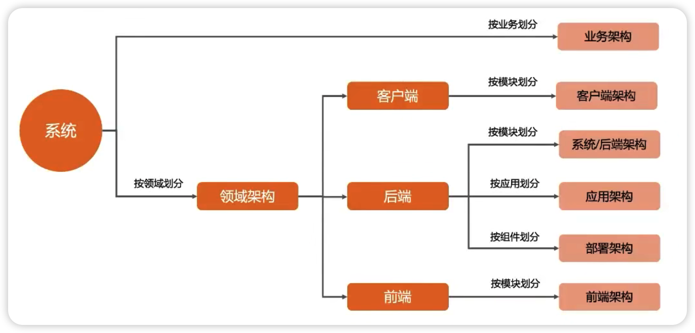

1.软件架构
软件架构指的是软件系统的顶层设计（Rank），它定义了系统由哪些角色（Role）组成，角色之间的关系（Relation）和运作规则（Rule），如下图所示。


````
业务架构
对应我们 4R 中的 Rank，也就是顶层结构。
业务架构指的是使用一套方法论/逻辑对产品（项目）所涉及到的业务进行边界划分，核心点就是把业务边界通过不同颜色模块标识出来，并做分组，同时不需要去考虑具体技术点。

应用架构
应用架构是对整个系统实现的总体上的架构，需要指出系统的层次、系统开发的原则、系统各个层次的应用服务，通过不同的颜色来标识角色，自顶向下分层设计。

技术架构
对应我们 4R 中的 Relation，也就是角色关系。
应用架构本身只关心需要哪些应用系统，哪些平台来满足业务目标的需求，而不会关心在整个构建过程中你需要使用哪些技术。
技术架构则是应接应用架构的技术需求，并根据识别的技术需求，进行技术选型，把各个关键技术和技术之间的关系描述清楚。技术架构解决的问题包括：纯技术层面的分层、开发框架的选择、开发语言的选择、涉及非功能性需求的技术选择。

````

架构设计的领域是很多的，比如业务架构，系统架构，技术架构，模型架构等等。。。

为什么要画架构图
既然架构的过程就是建模的过程，为什么我们要费时费力的去画架构图呢？直接用代码或者文字体现不就行了吗？我觉得这个问题可以从 2 点方面来回答：


从技术角度来讲：架构图相比其他表现方式，可以更方便的表明当前系统的结构体系，减少同事或者与客户之间的认知障碍，达到统一认知。
从阅读角度来讲：图的表现力远远高于文字的表现力，这也是为什么人们常说“一图胜千言，NO 图 NO BB”。

2.架构图分类


````
2.1 搞清楚要画的架构图的类型
2.2 抽离架构图中的关键要素
2.3 梳理各个要素之间的关系：包含关系 、引用关系、同级关系等等
2.4 根据以上信息串联起来，并标识清楚。
````


